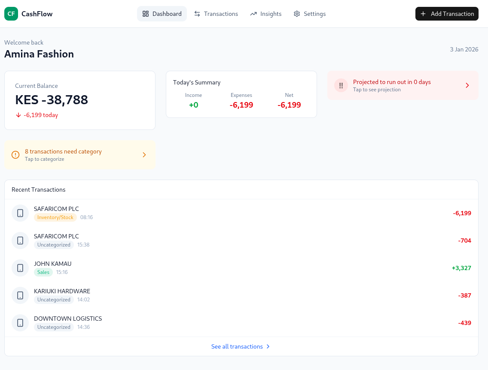

# SME Cash Flow Dashboard

[](https://github.com/jeffgicharu/sme-cashflow-dashboard/actions/workflows/ci.yml)

A lot of small online sellers in Kenya run their business through M-Pesa but have no visibility into their cash flow. They know money comes in and goes out, but can't tell you their margins, their biggest expenses, or whether they'll be able to pay rent next month.

This dashboard connects to your M-Pesa Till via the Daraja API and gives you that visibility. You get transaction syncing, auto-categorization, 30-day projections, and PDF reports you can show a bank when applying for a loan.

**Try it:** [sme-cashflow-dashboard.vercel.app](https://sme-cashflow-dashboard.vercel.app)



## Running locally

You'll need Node 20+, plus accounts on [Clerk](https://clerk.com), [Neon](https://neon.tech), and the [Safaricom Developer Portal](https://developer.safaricom.co.ke).

```bash
git clone git@github.com:jeffgicharu/sme-cashflow-dashboard.git
cd sme-cashflow-dashboard
npm install
cp .env.example .env.local
```

Fill in your credentials in `.env.local`, then:

```bash
npm run db:push    # create tables
npm run db:seed    # add demo data
npm run dev        # start the app
```

Open [localhost:3000](http://localhost:3000). You'll go through a short onboarding flow, then land on a dashboard showing your balance, recent transactions, and cash flow projection.

## Built with

Next.js 16 with the App Router, TypeScript in strict mode, Postgres on Neon with Drizzle ORM. Auth is handled by Clerk. UI is Tailwind + shadcn components. Charts are Recharts.

The app works offline as a PWA - transactions you add while offline sync when you're back online.

## Tests

```bash
npm run test:run    # vitest
npm run test:e2e    # playwright (run npm run build first)
```

## License

MIT
